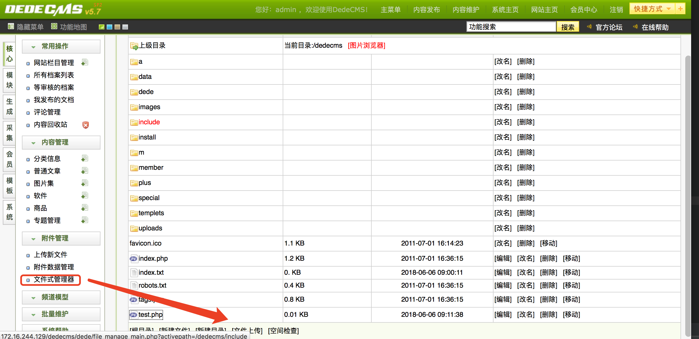
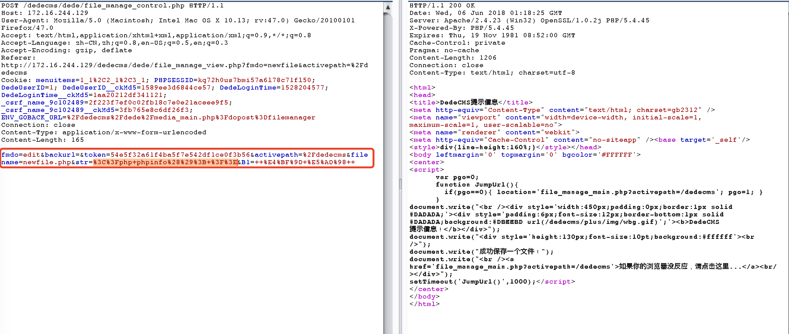
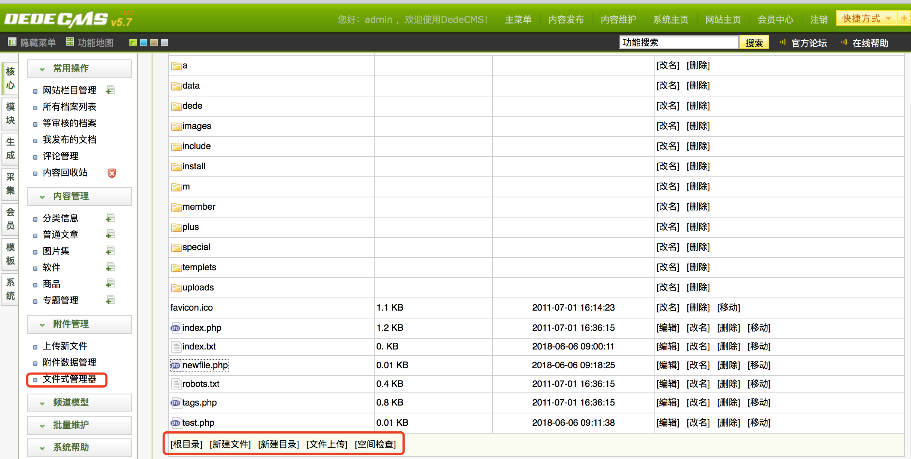

# dedecms v5.7 sp2 代码审计

## 任意文件上传2（file upload vulnerability）

### 原理分析

漏洞点：dede/file_manage_control.php 112-137:

```php
else if($fmdo=="upload")
{
    $j=0;
    for($i=1; $i<=50; $i++)
    {
        $upfile = "upfile".$i;
        $upfile_name = "upfile".$i."_name";
        if(!isset(${$upfile}) || !isset(${$upfile_name}))
        {
            continue;
        }
        $upfile = ${$upfile};
        $upfile_name = ${$upfile_name};
        if(is_uploaded_file($upfile))
        {
            if(!file_exists($cfg_basedir.$activepath."/".$upfile_name))
            {
                move_uploaded_file($upfile, $cfg_basedir.$activepath."/".$upfile_name);
            }
            @unlink($upfile);
            $j++;
        }
    }
    ShowMsg("成功上传 $j 个文件到: $activepath","file_manage_main.php?activepath=$activepath");
    exit();
}
```

这里也是丝毫没有针对上传的任何内容做过滤嘛

### poc构造




## 任意写入文件（Any file write vulnerability）

### 原理分析

漏洞点：dede/file_manage_control.php 69-87:

```php
else if($fmdo=="edit")
{
    csrf_check();
    $filename = str_replace("..", "", $filename);
    $file = "$cfg_basedir$activepath/$filename";
    $str = stripslashes($str);
    $fp = fopen($file, "w");
    fputs($fp, $str);
    fclose($fp);
    if(empty($backurl))
    {
        ShowMsg("成功保存一个文件！","file_manage_main.php?activepath=$activepath");
    }
    else
    {
        ShowMsg("成功保存文件！",$backurl);
    }
    exit();
}
```

这里没有针对内容做丝毫的过滤处理，所以可以直接写入php脚本。

### poc构造





## 一些思考

最近看到的很多cms其实有文件管理功能，可以列文件，增加文件，修改文件，删除文件。但是这种功能对于cms来说真的有用吗，你允许上传，允许创建文件，却不对上传内容，文件内容进行校验。虽然很多地方的安全性蛮高的了，但是木桶效应，毁所有，至于这两个算不算漏洞，我觉得算，你们觉的呢。

