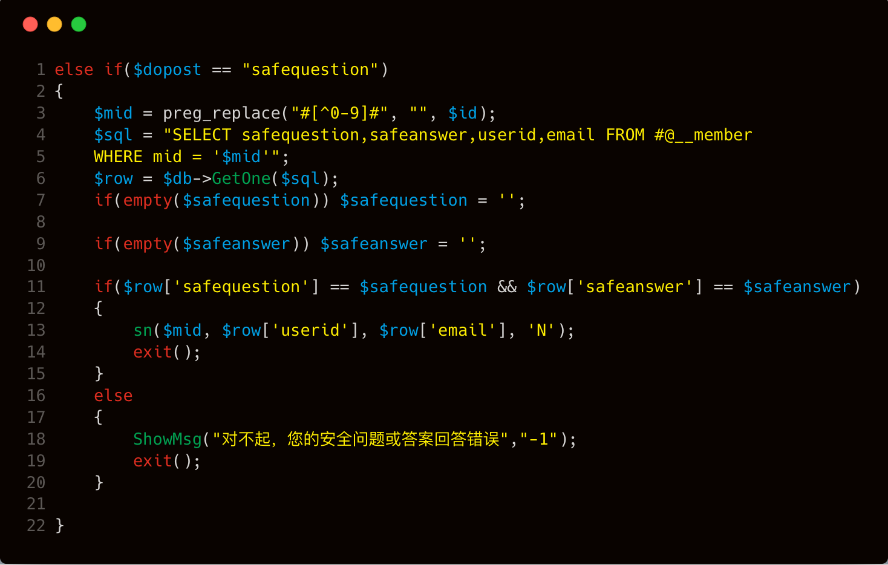
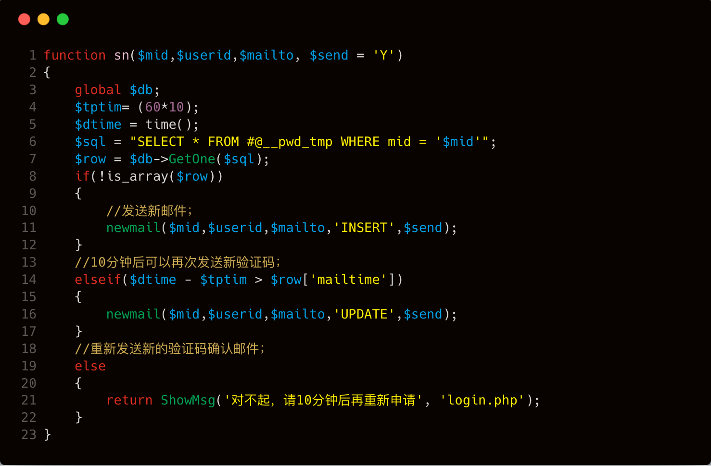
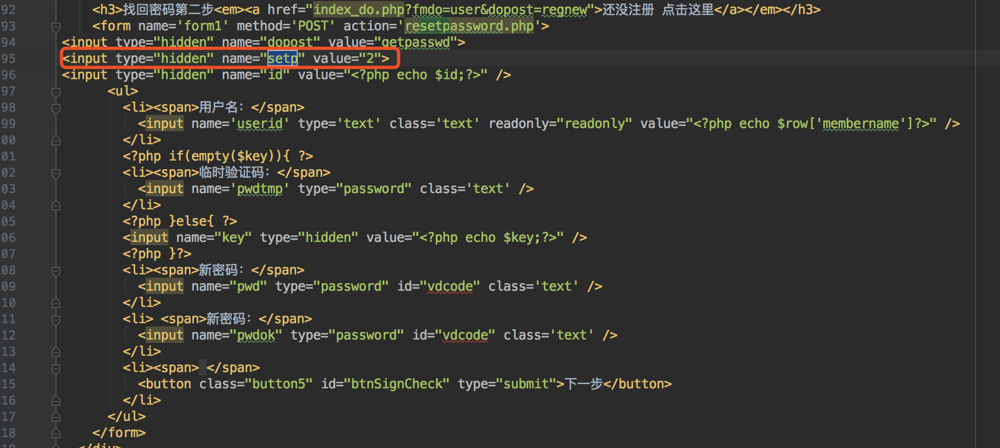
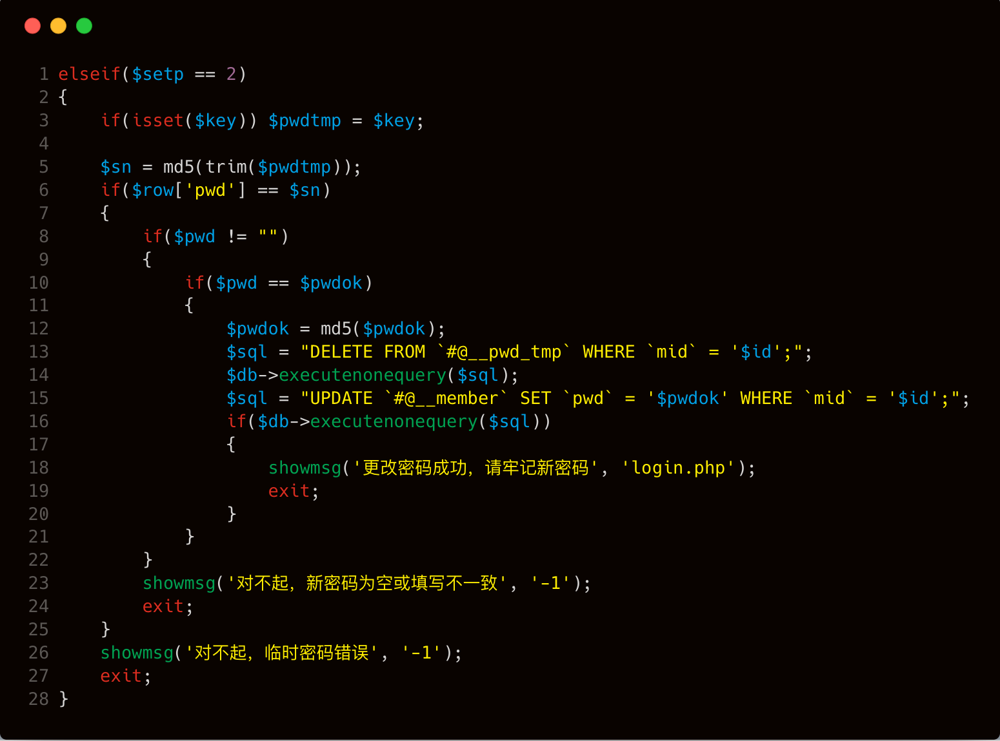
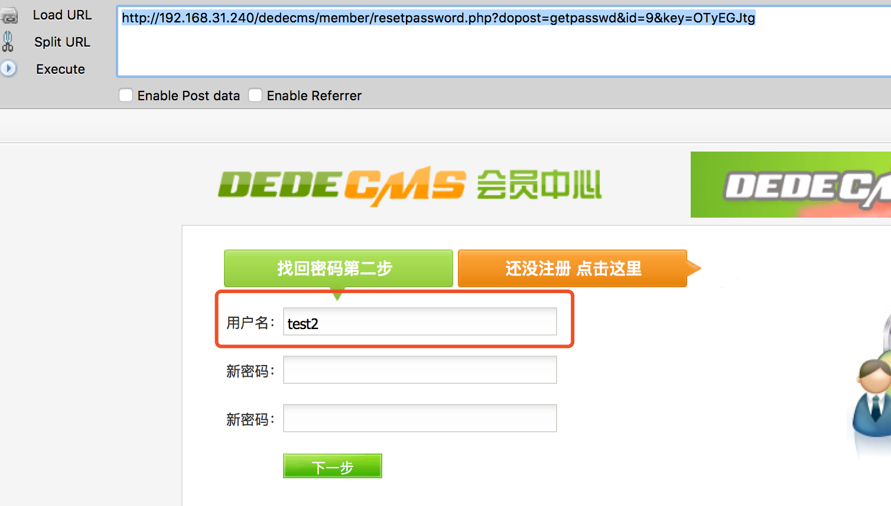

## 漏洞分析

**DeDecms V5.7SP2正式版** ,该CMS存在未修复的任意用户密码重置漏洞。漏洞的触发点在 **member/resetpassword.php** 文件中，由于对接收的参数 **safeanswer** 没有进行严格的类型判断，导致可以使用弱类型比较绕过。我们来看看相关代码：



针对上面的代码做个分析，当 **\$dopost** 等于 **safequestion** 的时候，通过传入的 **\$mid** 对应的 **id** 值来查询对应用户的安全问题、安全答案、用户id、电子邮件等信息。跟进到 **第11行** ，当我们传入的问题和答案非空，而且等于之前设置的问题和答案，则进入 **sn** 函数。然而这里使用的是 **==** 而不是 **===** 来判断，所以是可以绕过的。假设用户没有设置安全问题和答案，那么默认情况下安全问题的值为 **0** ，答案的值为 **null** （这里是数据库中的值，即 **$row['safequestion']="0"** 、 **$row['safeanswer']=null** ）。当没有设置 **safequestion** 和 **safeanswer** 的值时，它们的值均为空字符串。第11行的if表达式也就变成了 **if('0' == '' && null == '')** ，即 **if(false && true)** ，所以我们只要让表达式 **\$row['safequestion'] == \$safequestion** 为 **true** 即可。下图是 **null == ''** 的结果：


我们可以利用 **php弱类型** 的特点，来绕过这里 **\$row['safequestion'] == \$safequestion** 的判断。


通过测试找到了三个的payload，分别是 **0.0** 、 **0.** 、 **0e1** ，这三种类型payload均能使得 **\$row['safequestion'] == \$safequestion**  为 **true** ，即成功进入 **sn** 函数。跟进 **sn** 函数，相关代码在 **member/inc/inc_pwd_functions.php** 文件中，具体代码如下：



在 **sn** 函数内部，会根据id到pwd_tmp表中判断是否存在对应的临时密码记录，根据结果确定分支，走向 **newmail** 函数。假设当前我们第一次进行忘记密码操作，那么此时的 **\$row** 应该为空，所以进入第一个 **if(!is_array(\$row))** 分支，在 **newmail** 函数中执行 **INSERT** 操作，相关操作代码位置在 **member/inc/inc_pwd_functions.php** 文件中，关键代码如下：


该代码主要功能就是发送邮件至相关邮箱，并且插入一条记录至 **dede_pwd_tmp** 表中。而恰好漏洞的触发点就在这里，我们看看 **第13行** 至 **第18行** 的代码，如果 **(\$send == 'N')** 这个条件为真，通过 **ShowMsg** 打印出修改密码功能的链接。 **第17行** 修改密码链接中的 **\$mid** 参数对应的值是用户id，而 **\$randval** 是在第一次 **insert** 操作的时候将其 **md5** 加密之后插入到 **dede_pwd_tmp** 表中，并且在这里已经直接回显给用户。那么这里拼接的url其实是

```
http://127.0.0.1/member/resetpassword.php?dopost=getpasswd&id=$mid&key=$randval
```

继续跟进一下 **dopost=getpasswd** 的操作，相关代码位置在 **member/resetpassword.php** 中，


在重置密码的时候判断输入的用户id是否执行过重置密码，如果id为空则退出；如果 **\$row** 不为空，则会执行以下操作内容，相关代码在 **member/resetpassword.php** 中。


上图代码会先判断是否超时，如果没有超时，则进入密码修改页面。在密码修改页面会将 **\$setp** 赋值为2。



由于现在的数据包中 **\$setp=2** ，因此这部分功能代码实现又回到了 **member/resetpassword.php** 文件中。



上图代码 **第6行** 判断传入的 **\$key** 是否等于数据库中的 **\$row['pwd']** ，如果相等就完成重置密码操作。

## 漏洞验证

我们分别注册 **test1** ， **test2** 两个账号

第一步访问 **payload** 中的 **url** 

```
http://127.0.0.1/dedecms/member/resetpassword.php?dopost=safequestion&safequestion=0.0&safeanswer=&id=9
```

这里 **test2** 的id是9


通过抓包获取到 **key** 值。


去掉多余的字符访问修改密码链接

```
http://192.168.31.240/dedecms/member/resetpassword.php?dopost=getpasswd&id=9&key=OTyEGJtg
```



最后成功修改密码，我将密码修改成 **123456** ，数据库中 **test2** 的密码字段也变成了 **123456** 加密之后的值。


