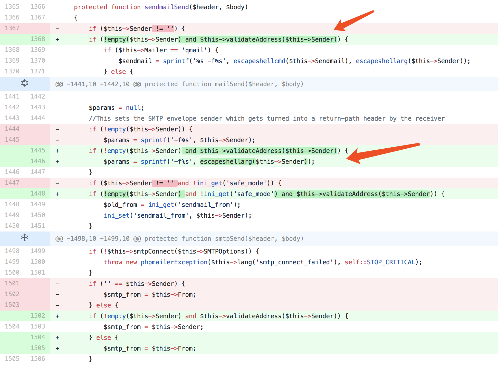
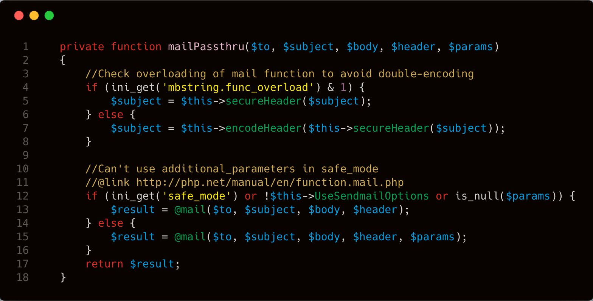
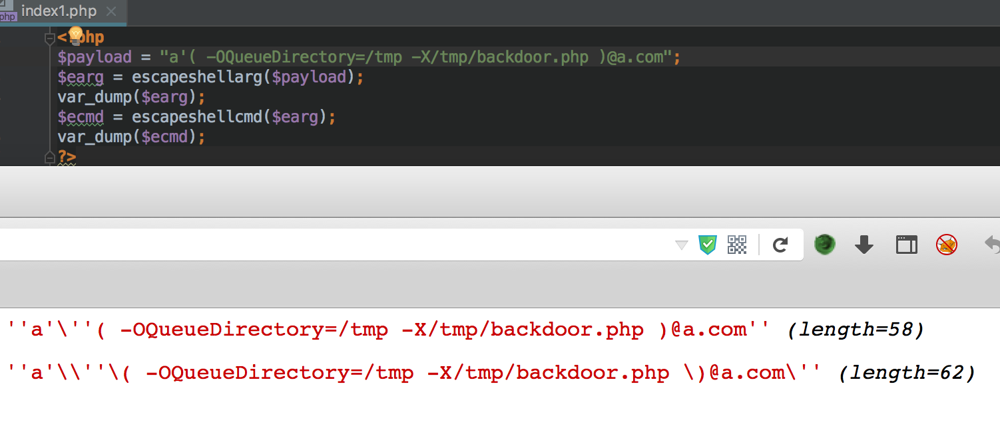

这里实例分析选择 **PHPMailer 命令执行漏洞** （  **CVE-2016-10045** 和 **CVE-2016-10033** ）。项目代码可以通过以下方式下载：

```bash
git clone https://github.com/PHPMailer/PHPMailer
cd PHPMailer
git checkout -b CVE-2016-10033 v5.2.17
```

## 漏洞原理

### CVE-2016-10033

在github上直接diff一下，对比一下不同版本的 **[class.phpmailer.php](https://github.com/PHPMailer/PHPMailer/compare/v5.2.17...v5.2.18#diff-ace81e501931d8763b49f2410cf3094d)** 文件，差异如下：



这里在 **sendmailSend** 函数中加了 **validateAddress** 函数，来针对发送的数据进行判断，判断邮箱地址的合法性。另外针对传入的数据，调用了 **escapeshellarg** 函数来转义特殊符号，防止注入参数。然而这样做，就引入了我们上面讨论的问题，即同时使用 **escapeshellarg** 函数和 **escapeshellcmd()** 函数，导致单引号逃逸。由于程序没有对传命令参数的地方进行转义，所以我们可以结合 **mail** 函数的第五个参数 **-X** 写入 **webshell** 。

下面详细看一下代码，漏洞具体位置在 **class.phpmailer.php** 中，我们截取部分相关代码如下 ：



在上图第12行处没有对 **\$params** 变量进行严格过滤，只是简单地判断是否为 **null** ，所以可以直接传入命令。我们继续往下看，我们发现在上图第12行，当 **safe_mode** 模式处于关闭状态时， **mail()** 函数才会传入 **\$params** 变量。

进一步跟跟进 **\$params** 参数，看看它是怎么来的。这个参数的位置在 **class.phpmailer.php** 中，我们截取部分相关代码，具体看下图 **第11行** ： 


很明显 **\$params** 是从 **\$this->Sender** 传进来的，我们找一下 **\$this->Sender** ，发现这个函数在 **class.phpmailer.php** 中，截取部分相关代码，具体看下图 **第10行** ：


这里在 **setFrom** 函数中将 **\$address** 经过某些处理之后赋值给 **\$this->Sender** 。我们详细看看 **\$address** 变量是如何处理的。主要处理函数均在 **class.phpmailer.php** 文件中，我们截取了部分相关代码，在下图 **第三行** 中使用了 **validateAddress** 来处理 **\$address** 变量。


所以跟进一下 **validateAddress** 函数，这个函数位置在 **class.phpmailer.php** 文件中。我们看看程序流程，相关代码如下：


分析一下这段代码，大概意思就是对环境进行了判断，如果没有 **prce** 并且 **php** 版本 **<5.2.0** ，则 **$patternselect = 'noregex'** 。接着往下看，在 **class.phpmailer.php** 文件中，有部分关于 **\$patternselect** 的 **swich** 操作，我只选择了我们需要的那个，跟踪到下面的 **noregex** 。


这里简单的只是根据 **@** 符号来处理字符，所以这里的payload很简单。

```
a( -OQueueDirectory=/tmp -X/var/www/html/x.php )@a.com
```

然后通过 **linux** 自身的 **sendmail** 写log的方式，把log写到web根目录下。将日志文件后缀定义为 **.php** ，即可成功写入webshell。

### CVE-2016-10045

diff一下5.2.20和5.2.18发现针对 **escapeshellcmd** 和 **escapeshellarg** 做了改动。


这里其实有个很奇妙的漏洞，针对用户输入使用 **escapeshellarg** 函数进行处理。所以，在最新版本中使用之前的 payload 进行攻击会失败，例如：

```
a( -OQueueDirectory=/tmp -X/var/www/html/x.php )@a.com
```

但是，却可以使用下面这个  **payload** 进行攻击：

```
a'( -OQueueDirectory=/tmp -X/var/www/html/x.php )@a.com
```

实际上，可用于攻击的代码只是在之前的基础上多了一个单引号。之所以这次的攻击代码能够成功，是因为修复代码多了  **escapeshellcmd** 函数，结合上 **mail()** 函数底层调用的 **escapeshellarg** 函数，最终导致单引号逃逸。



我们的 **payload** 最终在执行时变成了

```
'-fa'\\''\( -OQueueDirectory=/tmp -X/var/www/html/test.php \)@a.com\'
```

按照刚才上面的分析，我们将payload化简分割一下就是`-fa\(`、`-OQueueDirectory=/tmp`、`-X/var/www/html/test.php`、`)@a.com'`，这四个部分。最终的参数就是这样被注入的。

## 漏洞利用

漏洞有一些基本要求：
**1、php version < 5.2.0**
**2、phpmailer < 5.2.18**
**3、php 没有安装 pcre（no default）**
**4、safe_mode = false（default）**

存在正则绕过之后，以及 **escapeshellarg**  和 **escapeshellcmd** 一起使用造成的神奇现象之后。

只需要 **phpmailer < 5.2.20** 

**[环境，poc，exp相关](https://github.com/opsxcq/exploit-CVE-2016-10033)**


